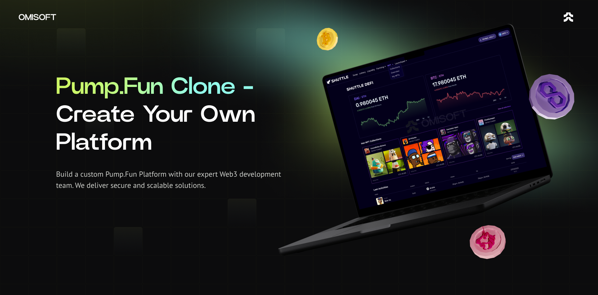

# Pump Fun Clone Script | Custom Telegram Earn Game Solution

The **Pump Fun Clone Script** provides a foundation for creating your own Telegram-based Web3 Earn Game. This repository showcases how our white-label solution enables businesses to quickly launch a community-driven game with engaging earning mechanics while minimizing development time and costs.

**Want to launch your own Pump Fun game?** Let us handle the technology so you can focus on marketing and growing your audience.

## Why Choose This Solution?

Our Pump Fun Clone Script accelerates your game launch by providing a ready-made yet highly customizable solution. It’s designed to save you time and money while giving you the flexibility to create a unique gaming experience.

## Features Included in the Solution

### Core Functionality

- **Earning Mechanics**: Engaging "pump-and-earn" gameplay with leaderboard features.  
- **User Authentication**: Secure login via email or other supported methods (excluding Telegram).  
- **Leaderboard**: Competitive leaderboards to boost player engagement.  
- **Reward Distribution**: Seamless handling of rewards for top performers.  
- **Admin Panel**: Manage user activity, monitor performance, and oversee rewards.  
- **Mobile Optimization**: Fully responsive design for an optimal experience on all devices.  
- **Figma Design File**: Editable assets to tailor the game’s look and feel.  
- **Localization**: Support for multiple languages to cater to global audiences.  
- **DDoS Protection**: Advanced security measures to ensure uninterrupted service.  
- **CI/CD Pipelines**: Automated updates and scaling for consistent performance.  
- **Marketing Analytics**: Integration with Google Analytics and Microsoft Clarity for actionable insights.

### Additional Features on Request

- **Social Media Integration**: Support for sharing progress and achievements on social platforms.  
- **Crypto Deposit & Withdrawal Integration**: Enable transactions via popular blockchain networks.  
- **Gamified Competitions**: Add features like timed challenges or thematic events.  
- **Customizable Gameplay**: Tailored features to enhance the uniqueness of your project. 

## Technology Overview

We use cutting-edge technologies to deliver a seamless and scalable gaming experience.

  
Front End (App & Admin Panel)

  <ul>
      <li>React.js</li>
      <li>Redux Toolkit</li>
      <li>TypeScript</li>
      <li>Wagmi</li>
      <li>Jest (Unit Testing)</li>
  </ul>

  
Back End

  <ul>
      <li>Node.js</li>
      <li>Express.js</li>
      <li>TypeScript</li>
      <li>MongoDB & Mongoose</li>
      <li>Swagger (API Documentation)</li>
      <li>Jest & Supertest (Testing)</li>
  </ul>

  
Blockchain

  <ul>
      <li>Solidity (Smart Contracts for Earn Game Mechanics)</li>
  </ul>

  
DevOps

  <ul>
      <li>Docker</li>
      <li>GitLab CI</li>
      <li>AWS Services</li>
  </ul>

## Pricing Packages

|                     | Basic Package      | NoFee Package  | Special Offer  |
|---------------------|--------------------|----------------|----------------|
| Revenue Share       | 5%                 | 0%             | 0%             |
| Maintenance Cost    | Free               | $2,000/year    | Free           |
| Community Size      | -                  | 10,000+        | 50,000+        |
| Custom Design       | Logo & Colors Only | Fully Custom   | Fully Custom   |
| Initial Cost        | $12,000            | $25,000        | Contact Us     |

## Request a Demo

Experience the Pump Fun Clone in action and learn how we can customize it to meet your needs.

- <a href="https://telegram.me/omisoft" target="_blank">Message Us on Telegram</a>  
- <a href="https://omisoft.net/contact-us?utm_campaign=pump-fun-clone&utm_medium=social&utm_source=github" target="_blank">Visit Our Website</a>  
- [Email Us Directly](mailto:hi@omisoft.net)  

## Supported Networks

The Pump Fun Clone Script supports multiple blockchain networks, including:  

- Ethereum, Arbitrum, Optimism, Polygon, Base, BNB Chain, Avalanche, Celo, Polkadot, and more.  
- Need a custom network? Contact us to discuss integration.

## Frequently Asked Questions

  
What is the Pump Fun Clone Script?

  
The Pump Fun Clone Script is a white-label solution for Telegram-based Earn Games. It is designed to make community-building easier and more affordable for Web3 projects.

  
How long does it take to launch?

  
With our white-label solution, you can launch your game in less than a month—3-4 times faster than custom development.

  
What features are included in the packages?

  
The Basic and NoFee packages differ by customization level, maintenance costs, and revenue share. Contact us for details about the Special Offer tailored for large communities.

  
Can the product be hosted on our servers?

  
Yes, we provide CI/CD pipelines for seamless updates and deployments on your infrastructure.

## Next Steps

Ready to turn the Pump Fun Clone into your own engaging Telegram game? Contact us to get started.  

Explore similar solutions:  

- [NotCoin Like Game](https://omisoft.net/demo/notcoin-script)  
- [Crypto Lottery](https://omisoft.net/demo/crypto-lottery)  
- [ICO & IDO Launchpad](https://omisoft.net/demo/white-label-crypto-launchpad-development)  
